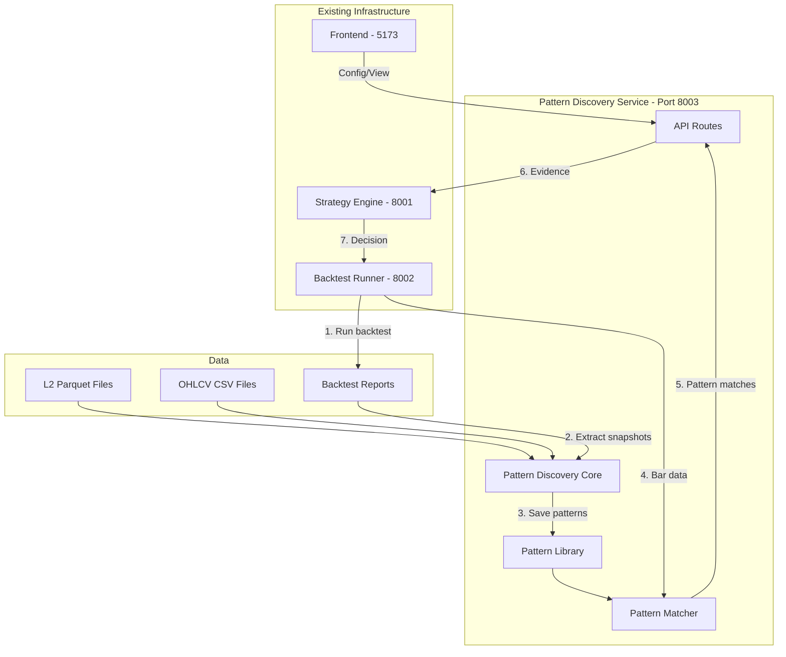

# Pattern Discovery Engine - Implementation Plan

## Overview

Nový samostatný modul pre objavovanie vzorov v trhových dátach. Komunikuje cez API s existujúcou infraštruktúrou (backtest-runner, strategy-engine), bez zásahov do existujúceho kódu.

## Architecture



## API Contracts

### Pattern Discovery Service (Port 8003)

#### POST /api/pattern-discovery/discover

Spustí offline pattern discovery na historických dátach.

**Request:**

```json
{
  "ticker": "MU",
  "date_from": "2025-11-02",
  "date_to": "2026-02-10",
  "discovery_config": {
    "clustering_enabled": true,
    "clustering_k_range": [50, 200],
    "sequential_enabled": true,
    "n_gram_range": [2, 5],
    "min_support": 10,
    "min_win_rate": 0.55,
    "min_sharpe": 1.0,
    "lookback_bars": 20,
    "forward_bars": 10
  },
  "strategy_api_url": "http://localhost:8001",
  "runner_api_url": "http://localhost:8002"
}
```

**Response:**

```json
{
  "job_id": "pd-abc123",
  "status": "running",
  "progress": {
    "phase": "extracting_snapshots",
    "current": 45,
    "total": 100
  },
  "created_at": "2026-02-13T15:00:00Z"
}
```

#### GET /api/pattern-discovery/jobs/{job_id}

Získa stav a výsledky discovery jobu.

**Response:**

```json
{
  "job_id": "pd-abc123",
  "status": "completed",
  "started_at": "2026-02-13T15:00:00Z",
  "completed_at": "2026-02-13T15:05:00Z",
  "results": {
    "snapshots_extracted": 1250,
    "cluster_patterns_found": 23,
    "sequential_patterns_found": 15,
    "total_patterns_saved": 38,
    "best_pattern": {
      "pattern_id": "cluster_42",
      "win_rate": 0.72,
      "support": 45,
      "avg_pnl_pct": 0.35
    }
  },
  "library_path": "pattern_library/MU_patterns_v1.json"
}
```

#### GET /api/pattern-discovery/patterns/{ticker}

Zoznam patternov pre ticker.

**Response:**

```json
{
  "ticker": "MU",
  "library_version": "v1",
  "patterns": [
    {
      "pattern_id": "cluster_42",
      "pattern_type": "cluster",
      "pattern_name": "Strong Delta Spike with Book Pressure",
      "direction": "bullish",
      "win_rate": 0.72,
      "support": 45,
      "avg_pnl_pct": 0.35,
      "confidence_interval": [0.58, 0.86],
      "feature_importance": {
        "l2_delta_z": 0.35,
        "l2_aggression_z": 0.28,
        "momentum_z": 0.15
      }
    }
  ]
}
```

#### POST /api/pattern-discovery/match

Real-time pattern matching pre aktuálny bar.

**Request:**

```json
{
  "ticker": "MU",
  "feature_vector": {
    "momentum_z": 1.2,
    "rsi_z": -0.5,
    "volume_z": 2.1,
    "atr_z": 0.3,
    "l2_delta_z": 2.5,
    "l2_aggression_z": 1.8,
    "l2_imbalance_z": 1.2,
    "l2_book_pressure_z": 0.9,
    "l2_flow_score_z": 1.5,
    "regime": "TRENDING",
    "trend_efficiency": 0.65,
    "hour_of_day": 10,
    "minute_of_hour": 30,
    "bar_body_ratio": 0.7,
    "close_location": 0.8
  },
  "recent_states": [
    { "state_label": "low_vol_neutral" },
    { "state_label": "delta_spike_bullish" }
  ],
  "config": {
    "min_similarity": 0.7,
    "max_matches": 3
  }
}
```

**Response:**

```json
{
  "matches": [
    {
      "pattern_id": "cluster_42",
      "pattern_type": "cluster",
      "pattern_name": "Strong Delta Spike with Book Pressure",
      "similarity_score": 0.85,
      "distance": 0.32,
      "direction": "bullish",
      "direction_confidence": 0.72,
      "historical_win_rate": 0.72,
      "historical_avg_pnl": 0.35,
      "historical_count": 45,
      "recommended_action": "entry_long",
      "recommended_stop_atr": 1.2,
      "recommended_target_rr": 2.5,
      "evidence_strength": 61.2,
      "evidence_reasoning": "Pattern 'Strong Delta Spike with Book Pressure' matched (similarity: 0.85, historical WR: 72%)"
    }
  ],
  "best_match": { "... as above ..." },
  "match_timestamp": "2026-02-13T15:30:00Z"
}
```

#### GET /api/pattern-discovery/evidence/{ticker}

Získa evidence pre EvidenceDecisionEngine (volané zo strategy-engine).

**Query params:**

- `feature_vector_json`: JSON encoded feature vector
- `recent_states_json`: JSON encoded recent states

**Response:**

```json
{
  "source_type": "pattern",
  "source_name": "Strong Delta Spike with Book Pressure",
  "direction": "bullish",
  "strength": 61.2,
  "calibrated": 0.72,
  "reasoning": "Pattern 'Strong Delta Spike with Book Pressure' matched (similarity: 0.85, historical WR: 72%)"
}
```

#### POST /api/pattern-discovery/tuner/run

Pattern-aware adaptive tuning.

**Request:**

```json
{
  "ticker": "MU",
  "date_from": "2025-11-02",
  "date_to": "2026-02-10",
  "pattern_config": {
    "pattern_library_path": "pattern_library/MU_patterns_v1.json",
    "pattern_min_similarity_options": [0.6, 0.7, 0.8, 0.9],
    "pattern_min_win_rate_options": [0.5, 0.55, 0.6, 0.65],
    "pattern_evidence_weight_options": [0.0, 0.1, 0.15, 0.2],
    "pattern_direction_filter_options": ["any", "bullish_only", "bearish_only"]
  },
  "tuner_config": {
    "method": "optuna",
    "n_trials": 50,
    "score_metric": "pnl_pct"
  },
  "strategy_api_url": "http://localhost:8001",
  "runner_api_url": "http://localhost:8002"
}
```

**Response:**

```json
{
  "job_id": "pt-xyz789",
  "status": "running",
  "created_at": "2026-02-13T15:00:00Z"
}
```

## File Structure

```
backtest-runner/
├── src/
│   └── pattern_discovery/
│       ├── __init__.py
│       ├── api_server.py              # FastAPI routes
│       ├── models.py                  # Pydantic models
│       ├── extractor.py               # Feature snapshot extraction
│       ├── clustering.py              # K-Means/GMM pattern discovery
│       ├── sequential.py              # N-gram pattern mining
│       ├── library.py                 # Pattern library persistence
│       ├── matcher.py                 # Real-time pattern matching
│       ├── evidence.py                # Evidence source for strategy engine
│       └── tuner_integration.py       # Integration with adaptive tuner
├── pattern_library/
│   └── .gitkeep
├── scripts/
│   └── run_pattern_discovery.py       # CLI for offline discovery
├── tests/
│   └── test_pattern_discovery.py
└── docs/
    └── PATTERN_DISCOVERY.md
```

## Integration Points

### 1. Backtest Runner Integration

Runner posiela bar data na pattern discovery service:

```python
# In runner (optional, via config)
async def send_bar_to_pattern_discovery(bar_data: dict, config: dict):
    if config.get("pattern_discovery_enabled"):
        async with httpx.AsyncClient() as client:
            await client.post(
                f"{config['pattern_discovery_url']}/api/pattern-discovery/match",
                json={
                    "ticker": bar_data["ticker"],
                    "feature_vector": bar_data["features"],
                    "recent_states": bar_data.get("recent_states", []),
                    "config": config.get("pattern_match_config", {})
                }
            )
```

### 2. Strategy Engine Integration

Strategy engine volá pattern discovery pre evidence:

```python
# In strategy engine (optional evidence source)
async def get_pattern_evidence(feature_vector: dict, config: dict) -> Optional[EvidenceSource]:
    if not config.get("pattern_discovery_enabled"):
        return None

    async with httpx.AsyncClient() as client:
        response = await client.get(
            f"{config['pattern_discovery_url']}/api/pattern-discovery/evidence/{ticker}",
            params={
                "feature_vector_json": json.dumps(feature_vector),
                "recent_states_json": json.dumps(recent_states)
            }
        )

        if response.status_code == 200:
            data = response.json()
            return EvidenceSource(
                source_type=data["source_type"],
                source_name=data["source_name"],
                direction=data["direction"],
                strength=data["strength"],
                calibrated=data["calibrated"],
                reasoning=data["reasoning"]
            )
    return None
```

### 3. Adaptive Tuner Integration

Pattern discovery tuner rozširuje existujúci adaptive tuner:

```python
# Pattern-aware tuning dimensions
PATTERN_TUNER_DIMENSIONS = {
    "pattern_min_similarity": [0.6, 0.7, 0.8, 0.9],
    "pattern_min_win_rate": [0.50, 0.55, 0.60, 0.65],
    "pattern_evidence_weight": [0.0, 0.1, 0.15, 0.2],
    "pattern_direction_filter": ["any", "bullish_only", "bearish_only"],
}
```

## Implementation Order

### Phase 1: Core Module (Models + Extraction)

1. Create `src/pattern_discovery/models.py` - Pydantic models
2. Create `src/pattern_discovery/extractor.py` - Feature snapshot extraction
3. Create `src/pattern_discovery/library.py` - Pattern library persistence

### Phase 2: Pattern Discovery

4. Create `src/pattern_discovery/clustering.py` - K-Means/GMM
5. Create `src/pattern_discovery/sequential.py` - N-gram mining

### Phase 3: Matching + API

6. Create `src/pattern_discovery/matcher.py` - Real-time matching
7. Create `src/pattern_discovery/evidence.py` - Evidence formatting
8. Create `src/pattern_discovery/api_server.py` - FastAPI routes

### Phase 4: Integration

9. Create `src/pattern_discovery/tuner_integration.py` - Tuner integration
10. Create `scripts/run_pattern_discovery.py` - CLI
11. Create `tests/test_pattern_discovery.py` - Tests

### Phase 5: Documentation

12. Create `docs/PATTERN_DISCOVERY.md` - Documentation

## Configuration

### Environment Variables

```bash
# Pattern Discovery Service
PATTERN_DISCOVERY_PORT=8003
PATTERN_DISCOVERY_HOST=0.0.0.0

# Integration
RUNNER_API_URL=http://localhost:8002
STRATEGY_API_URL=http://localhost:8001

# Storage
PATTERN_LIBRARY_PATH=pattern_library
```

### Run Config Extension

```json
{
  "pattern_discovery_enabled": true,
  "pattern_discovery_url": "http://localhost:8003",
  "pattern_library_path": "pattern_library/MU_patterns_v1.json",
  "pattern_match_config": {
    "min_similarity": 0.7,
    "max_matches": 3
  }
}
```

## Dependencies

```toml
# pyproject.toml additions
[project.dependencies]
scikit-learn = ">=1.3.0"
numpy = ">=1.24.0"
fastapi = ">=0.104.0"
uvicorn = ">=0.24.0"
httpx = ">=0.25.0"
pydantic = ">=2.0.0"
```

## Testing Strategy

1. **Unit Tests**: Each module independently
2. **Integration Tests**: API endpoints with mock data
3. **End-to-End**: Full discovery → match → evidence flow
4. **Validation**: Walk-forward validation on historical data

## Success Metrics

| Metric                       | Target                     |
| ---------------------------- | -------------------------- |
| Pattern Discovery Time       | < 5 min for 3 months data  |
| Pattern Match Latency        | < 10ms per bar             |
| Discovered Patterns Win Rate | > 55% on validation set    |
| Pattern Library Size         | 20-100 patterns per ticker |
