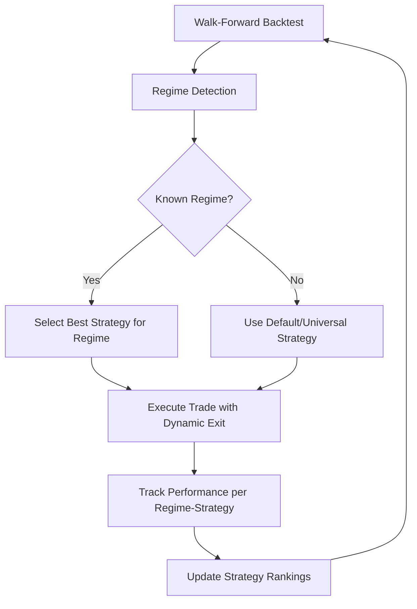

# Walk-Forward Backtest s Regime Detection a Adaptívnymi Stratégiami

## Cieľ

Vytvoriť walk-forward backtest systém, ktorý:

1. Používa **regime detection** na výber najvhodnejšej stratégie
2. **Sleduje výkonnosť** stratégií v rôznych režimoch
3. Používa **dynamické výstupy**: čiastočný zisk + trailing stop
4. Preferuje **menšie zisky, ale viac trades** (vyššia frekvencia)

## Architektúra



## Komponenty

### 1. Regime-Aware Strategy Selector

- **Vstup**: Detekovaný režim (TRENDING, CHOPPY, MIXED)
- **Výstup**: Najlepšia stratégia pre daný režim
- **Logika**:
  - Udržiava historické výsledky pre každú stratégiu v každom režime
  - Vyberá stratégiu s najvyšším win rate alebo profit factor
  - Fallback na default ak nie sú dáta

### 2. Dynamic Exit Manager

- **Čiastočný zisk**: Zatvoriť 50% pozície pri dosiahnutí prvého cieľa
- **Trailing stop**: Držať zvyšných 50% s trailing stop
- **Konfigurácia**:
  ```python
  partial_profit_pct: float = 0.5      # 50% pozície
  partial_profit_target: float = 1.0   # 1% zisk na prvý exit
  trailing_stop_pct: float = 0.5       # 0.5% trailing
  ```

### 3. Performance Tracker

- Sleduje pre každý pár (regime, stratégia):
  - Počet trades
  - Win rate
  - Avg profit/loss
  - Profit factor
  - Max drawdown
- Periodicky aktualizuje ranking stratégií

### 4. Walk-Forward Runner

- Beží cez viac dní/tickerov
- Pre každý deň:
  1. Načíta dáta
  2. Detekuje režim
  3. Vyberie stratégiu
  4. Spustí backtest
  5. Uloží výsledky
- Agreguje výsledky naprieč všetkými dňami

## Stratégie podľa Režimu

| Režim    | Preferované Stratégie       | Dôvod             |
| -------- | --------------------------- | ----------------- |
| TRENDING | Pullback, Momentum          | Trend following   |
| CHOPPY   | Mean Reversion, VWAP Magnet | Návrat k priemeru |
| MIXED    | Rotation, VWAP Magnet       | Vyvážený prístup  |

## Parametre pre Vyššiu Frekvenciu Trades

### Mean Reversion

- `entry_deviation_pct`: 0.8% (znížené z 1.5%)
- `min_confidence`: 50 (znížené z 60)

### Rotation

- `rotation_threshold`: 0.5% (znížené z 2.0%)
- `lookback_period`: 10 (znížené z 20)

### Momentum

- `consolidation_bars`: 5 (rýchlejší vstup)
- `volume_threshold`: 1.2 (znížené z 1.5)

### Pullback

- `pullback_threshold_pct`: 0.4 (znížené z 0.5)
- `min_confidence`: 60 (znížené z 65)

## Implementačný Plán

### Fáza 1: Performance Tracker

- [ ] Vytvoriť `PerformanceTracker` class
- [ ] Ukladať výsledky per (regime, stratégia, ticker)
- [ ] Implementovať ranking algoritmus

### Fáza 2: Dynamic Exit

- [ ] Rozšíriť `DayTradingManager` o partial profit
- [ ] Implementovať split pozície (50/50)
- [ ] Pridať trailing stop na zvyšok

### Fáza 3: Regime-Aware Selector

- [ ] Vytvoriť `StrategySelector` class
- [ ] Integrovať s `DayTradingManager`
- [ ] Pridať fallback logiku

### Fáza 4: Walk-Forward Runner

- [ ] Rozšíriť `batch_runner.py`
- [ ] Pridať walk-forward logiku
- [ ] Agregovať výsledky

### Fáza 5: Testing & Refinement

- [ ] Spustiť na viacerých tickeroch
- [ ] Analyzovať výsledky
- [ ] Doladiť parametre

## Očakávané Výsledky

- **Vyššia frekvencia trades**: 5-10 trades/deň namiesto 0-2
- **Menšie zisky na trade**: 0.3-0.8% namiesto 1-2%
- **Lepší win rate**: Vďaka regime-specific stratégiám
- **Nižšie drawdowny**: Vďaka čiastočným výstupom

## Metriky na Sledovanie

1. **Trades per day**: Cieľ 5+
2. **Win rate by regime**: Porovnanie stratégií
3. **Profit factor by regime**: Efektívnosť
4. **Avg trade duration**: Optimálny hold time
5. **Max consecutive losses**: Risk assessment
